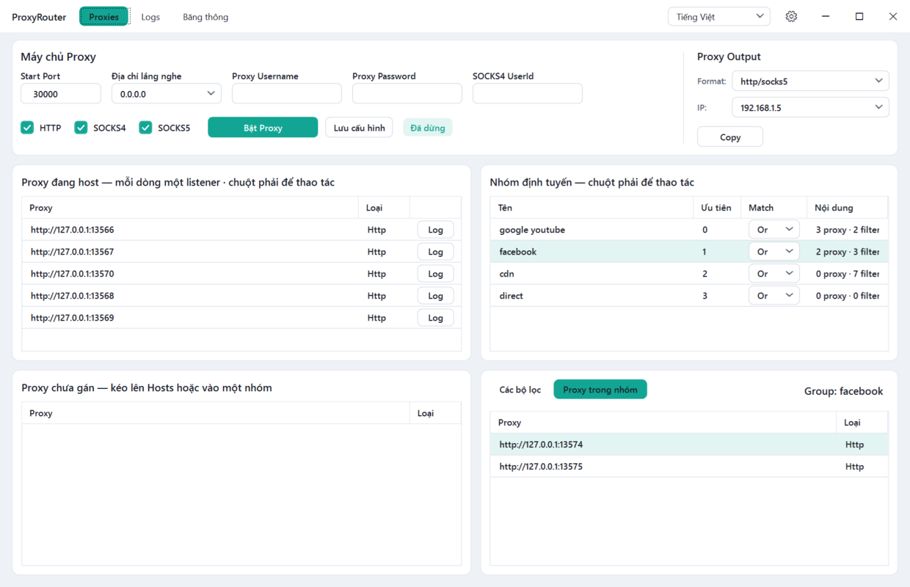
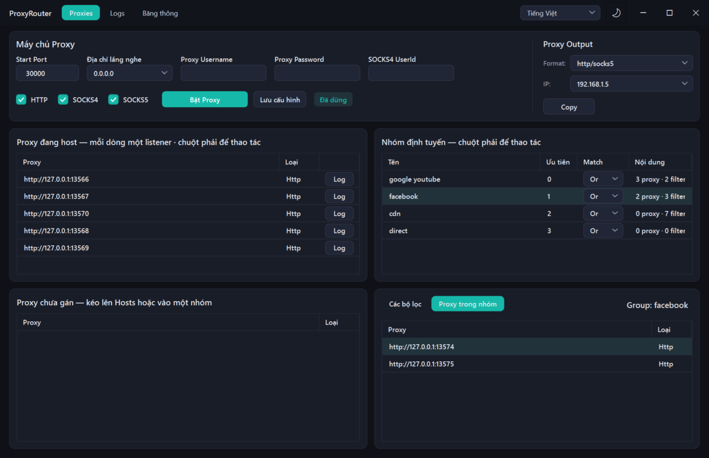
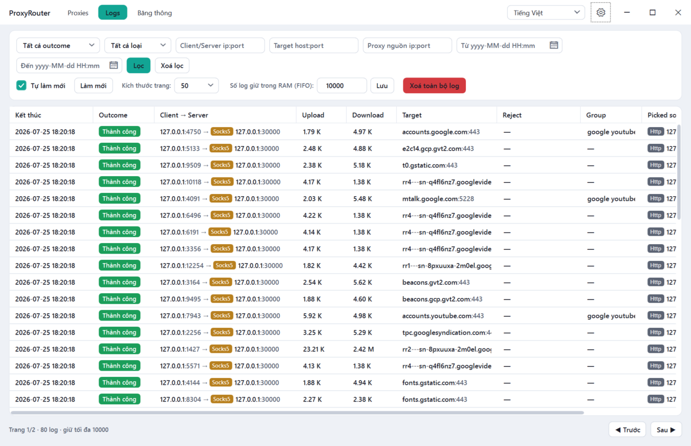
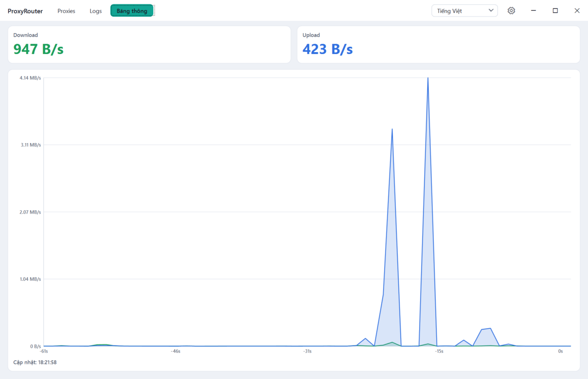

# ProxyRouter WPF

[English](README.md) · **Tiếng Việt**

Bản chuyển sang ứng dụng desktop Windows (WPF) của [ProxyRouter](https://github.com/tqk2811/ProxyRouter)
— một proxy server chạy tại máy, lắng nghe trên các cổng cục bộ và chuyển tiếp lưu lượng tới các
proxy đích (upstream), kèm luật định tuyến theo tên miền. Bản desktop này bỏ toàn bộ tầng web
ASP.NET và cơ sở dữ liệu SQL.

> Thuật ngữ dùng trong dự án được giải thích trong [docs/Glossary-vi.md](docs/Glossary-vi.md).

## Ứng dụng làm được gì

- Mở các listener **HTTP / SOCKS4 / SOCKS5** ngay tại máy (tự nhận diện giao thức theo từng kết
  nối). Mỗi proxy trong nhóm **Hosts** sinh ra một listener ở cổng `StartPort + i`, bind vào địa chỉ
  lắng nghe do người dùng chọn (mặc định `0.0.0.0`, hoặc một địa chỉ LAN bất kỳ của máy).
- Hai ngăn chứa proxy: **Hosts** (mỗi dòng thành một cổng lắng nghe) và **Chưa gán** (kho dự trữ,
  không lắng nghe cổng nào); ngoài ra một proxy có thể thuộc về một **nhóm định tuyến**.
- **Định tuyến theo nhóm + bộ lọc**: đổi proxy đích theo từng request dựa trên host đích —
  `Wildcard`, `Equals`, `StartsWith`, `EndsWith`, `Contains`, `CIDR`, `Regex`, hoặc ngưỡng luỹ kế
  `TotalBytes`; kết hợp bằng chế độ khớp `And`/`Or` và phủ định `NOT`.
- **Log tunnel** lưu trong hàng đợi FIFO giới hạn trong RAM (đầy thì bỏ dòng cũ nhất), có lọc, sắp
  xếp, phân trang và cửa sổ xem chi tiết chỉ đọc. Dòng log xuất hiện ngay khi kết nối mở (trạng thái
  `Đang hoạt động`, số byte cập nhật realtime) và được chốt lại khi tunnel đóng.
- **Băng thông**: biểu đồ realtime cho toàn máy (đọc bộ đếm mạng qua WMI).
- Giao diện **Tối / Sáng / Theo hệ thống** và ngôn ngữ **Tiếng Việt / English**, đổi trực tiếp trên
  thanh tiêu đề. Phong cách giao diện theo
  [AndroidSyncControl](https://github.com/tqk2811/AndroidSyncControl).
- Kéo–thả giữa các bảng proxy: đổi thứ tự ưu tiên, chuyển proxy qua lại giữa Hosts, Chưa gán và các
  nhóm.

## Ảnh chụp màn hình

### Tab Proxy — listener, nhóm định tuyến và bộ lọc

| Sáng | Tối |
| --- | --- |
|  |  |

### Tab Log — lọc, phân trang và giới hạn FIFO trong RAM



### Tab Băng thông — biểu đồ tải lên / tải xuống realtime



## Khác biệt so với bản gốc (cố ý)

- **Không dùng cơ sở dữ liệu.** Cấu hình proxy lưu trong file JSON (`proxyrouter.config.json`) đặt
  cạnh file thực thi; log tunnel chỉ nằm trong RAM.
- **Không đăng nhập / không quản lý người dùng** — ứng dụng desktop một người dùng.
- Đã bỏ các trang: `Dashboard` (trang chủ), `Dashboard/IpWhiteList`, `Dashboard/Admin/Log`.
- **Không tự chạy**: proxy engine không bao giờ tự khởi động khi mở app. Bật thủ công ở tab
  **Proxy**.

## Yêu cầu

- Windows 10/11
- .NET 8 SDK (`net8.0-windows`)

## Build & chạy

```bash
dotnet build ProxyRouterWpf.slnx -c Release
dotnet run --project src/ProxyRouterWpf/ProxyRouterWpf.csproj
```

## Đánh số phiên bản & phát hành

Phiên bản sinh từ [GitVersion](GitVersion.yml): tag `vM.N.0` mở một nhánh minor, mọi bản build trên
đó có số `M.N.<số commit kể từ tag>` (`1.0.0`, `1.0.1`, …). Bản Debug bỏ qua GitVersion và luôn báo
`0.0.0-debug`. Muốn lên dòng mới thì tạo tag `vM.<N+1>.0` rồi push tag.

Việc phát hành **chỉ chạy trên nhánh master** và phải chủ động bật:
[`.github/workflows/release.yml`](.github/workflows/release.yml) chỉ chạy khi commit đầu của lần
push có chứa marker `[release]` (hoặc khi kích hoạt thủ công từ master). Workflow publish bản
`win-x64` dạng framework-dependent, nén thành `ProxyRouterWpf-M.N.<n>-win-x64.zip` và đính kèm vào
GitHub Release mang tên tag `vM.N.0`; phần ghi chú của Release liệt kê mọi bản build `[release]` kể
từ tag đó.

```powershell
.\Changelog.ps1                        # sinh lại CHANGELOG.md (git-cliff, Conventional Commits)
.\Release.ps1 -Message "msg" -Push     # changelog + commit kèm [release] + push (kích hoạt CI)
```

Commit phải theo chuẩn [Conventional Commits](https://www.conventionalcommits.org) — changelog và
release notes đều sinh từ đó. Nếu chỉ muốn dựng lại phần ghi chú của một Release đã có, push một
commit gắn `[release_notes_only]` hoặc chạy workflow thủ công với tuỳ chọn tương ứng.

## Cấu trúc dự án

```
src/ProxyRouterWpf/
  Enums/            các enum nghiệp vụ (loại proxy, loại bộ lọc, kết quả tunnel, ...)
  Models/           model cấu hình + view model (POCO, lưu bằng JSON)
  Configuration/    ConfigStore (JSON), AppServices (điểm khởi tạo dịch vụ)
  Services/         CRUD trong bộ nhớ, một người dùng (proxy / nhóm / bộ lọc / cấu hình)
  Proxy/            proxy engine (manager, session, handler) dựng trên TqkLibrary.Proxy
    EventLogs/      đường ống log tunnel trong RAM (kho FIFO, consumer qua channel, cache traffic)
  Bandwidth/        bộ lấy mẫu WMI + cache vòng
  Localization/     từ điển chuỗi EN/VI + LocalizationManager
  Themes/           Colors.Dark/Light + Controls.xaml + ThemeManager
  Converters/       các value converter
  ViewModels/       MVVM (CommunityToolkit.Mvvm)
  Views/            các tab (Proxy, Log, Băng thông) + dialog + control tự viết
```

## Ghi công

Proxy engine lõi: [`TqkLibrary.Proxy`](https://www.nuget.org/packages/TqkLibrary.Proxy).
